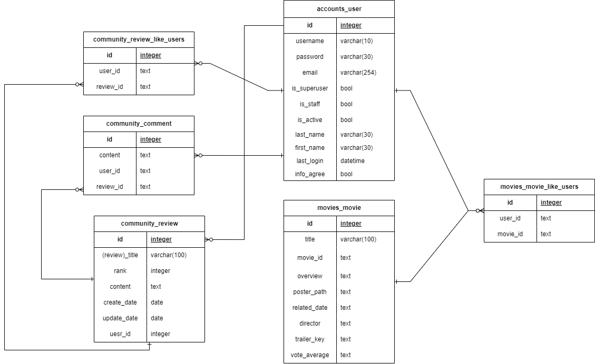

# 영화 추천 웹사이트 프로젝트

# No_ahsack

## 팀원 정보 및 업무 분담 내역

- 권민우
  
  - accounts 기능 디자인, 메인화면 UI/UX 디자인
  
  - 영화추천 알고리즘, 영화 검색 알고리즘 개발
  
  - 데이터베이스 설계
  
  - json 데이터 파일, 로직 구성 및 생성

- 강노아
  
  - navbar, CRUD, 메인화면 UI/UX 디자인
  
  - templates reference 적용
  
  - navbar, community crud 개발, 데이터베이스 설계
  
  - vanilaJS활용, movie_like, review_like 비동기 기능 구현

## 목표 서비스 구현 및 실제 구현 정도

- 목표 서비스 : 감독 기반의 영화 추천 서비스

- 실제 구현 정도
  
  - 프론트엔드
    
    - 페이지 랜더 시 애니메이션 구현
    
    - 영화 포스터 mouse over event시 애니메이션 효과 구현
    
    - navbar 및 버튼 hover 구현
  
  - 백엔드
    
    - 검색 (초성 검색 가능, 축약, 애너그램 검색 가능)
    
    - TMDB API 활용 영화 Detail에서 감독 조회 후 감독 참여작 데이터 수집
    
    - 영화 좋아요 기능으로 중계 테이블 활용하여 사용자가 좋아한 영화의 감독
      
      데이터를 수집하여 해당 감독의 영화를 추천
    
    - Community CRUD 구현
    
    - 회원가입, 로그인 구현

## 데이터베이스 모델링 (ERD)

## 영화 추천 알고리즘에 대한 기술적 설명

- 저희의 영화 추천 알고리즘은 다음과 같은 방식으로 동작합니다.
  
  1. 사용자가 로그인한 경우, 해당 사용자가 좋아하는 영화의 감독들을 기준으로 추천
     
     영화를 선정합니다. 좋아하는 영화의 감독들을 카운트하여 감독별로 좋아하는 정도
     
     를 측정하여 이름과 함께 데이터를 전송합니다.
  
  2. 영화 데이터베이스에서 감독 이름과 일치하는 영화들을 찾습니다.
  
  3. 감독별로 좋아하는 정도를 기준으로 내림차순으로 정렬하여 측정도가 높은 감독의
     
     작품을 우선적으로 추천목록 데이터에 추가될 수 있도록 합니다.
  
  4. 추천 영화리스트가 완성되면 추천 프로세스를 종료합니다.
  
  5. 최종적으로 추천된 영화 목록 중 4개를 선정하여 사용자에게 제공합니다.

- 이 알고리즘은 사용자가 좋아하는 영화의 감독을 기반으로 비슷한 스타일이나 장르를

        가진 다른 영화를 추천하는 방식입니다. 사용자의 영화 선호도를 파악하고 그에 따라

        개인 맞춤형 추천을 제공하기 위해 좋아하는 영화와 감독의 정보를 활용합니다.

## 서비스 대표 기능에 대한 설명

- 로그인, 로그아웃
  
  - No_ahsack은 로그인 하지 않을 경우 절대 서비스를 제공하지 않음.

- 추천 영화 조회
  
  - 사용자들에게 추천되는 영화 목록을 제공합니다.
  
  - 로그인 후 하나 이상의 영화에 "좋아요"를 누르면 좋아한 영화들의 감독데이터를
    
    수집, 이후 수집한 감독데이터를 기반으로 다른 영화를 추천
  
  - 좋아요한 영화의 경우 이미 본 영화로 판단하여 추천 목록에서 제외

- 영화 검색
  
  - 좋아하는 영화를 검색하고 조회할수있습니다.
  
  - 초성 검색 시 검색내용이 영화 제목과 일치하는 경우 목록에 영화 정보가 표시됩니다
  
  - 축약하여 검색할 경우 단어들이 포함된 영화들의 정보가 목록에 표시됩니다.

- 영화 상세 정보
  
  - 사용자가 특정 영화를 선택하면 해당 영화의 상세 정보를 제공합니다.
  
  - 유투브에 저장되어있는 영화의 예고편을 한글(공식영상) -> 한글 예고편 ->
    
    영어(공식영상) -> 영어 예고편 순으로 우선탐색하여 제공합니다.
  
  - 사용자는 영화에 좋아요를 표시할 수 있으며, 좋아요 한 영화를 기반으로
    
    추천영화목록 알고리즘이 작동합니다.

- 커뮤니티 기능
  
  - 사용자는 영화에 대한 리뷰와 원하는 내용을 작성할 수 있으며, 0~5점으로
    
    영화에 대한 추천도를 표시할 수 있습니다.
  
  - 좋아요와 댓글 작성을 지원합니다.
  
  - 본인이 작성한 글의 수정과 삭제가 가능합니다. 다른 사용자가 작성한 리뷰는
    
    읽기와 댓글 작성만 가능합니다.

## 느낀 점

### 권민우

    장고만을 활용하여 프로젝트를 완성하고자 하였습니다.

    요청을 주고 받지 않기 때문에 생기는 이점도 있었지만 Vue의 기능을 Django에서

    활용할 방법에 대한 어려움을 겪었습니다. 또한 Django 사용에는 더 익숙해 졌지만,

    Vue와 데이터를 주고 받는 과정에서 생기는 문제를 해결하는 경험을 해보지 못해

    아쉽습니다.

    PJT를 통해 이론으로 보았을 땐 쉬워보였는데 실제로 작성하려 하니 어려운 내용도

    많았습니다. 특히 초기 PJT 기획 설계 단계에 대한 중요성을 많이 느꼈습니다. 제대로

    틀을 정립하지 않고 프로젝트를 시행했다면 많은 잦은 변경으로 인해 보다 부족한

    결과물이 나왔을 것 같습니다. 1학기 동안 배웠던 모든 내용을 정리하는 한 주 였던

    것 같습니다. 프로젝트 제출 이후 한 번 더 내용을 정리하면 많은 도움이 될 것 같습니다.     

### 강노아

    주어진 시간내에 일정을 조절하고 작업량을 정하는것이 좋았습니다.

    정처없이 작업을 나아가기보다 워킹데이를 효율적으로 구분하여 작업을 정해둔것이 프로

    젝트 완성에 큰 도움이 되었습니다. 특히 백엔드 개발자를 지망함에 있어 crud를 다시한번

    공부하며 이해하는것이 앞으로 저에게 큰 자산이 될것이라 생각합니다.

    프론트 파트를 만듦에 있어 기존의 레퍼런스를 활용하는 방법을 능숙하게 하고 싶었습

    니다. vanila JS를 활용하는것과 Vue를 사용하는것의 전체적인 로직은 같다는것을 잘 알수

    있었습니다. 또한 ERD를 설계함에 있어 처음에는 막막했으나 작업을하며 수정하고 보완함

    으로 감을 잡아갈 수 있었고 첫 설계의 중요성을 크게 느꼈습니다.

    서비스를 직접 만드는 것은 개론수업과는 전혀 다른부분임을 알았고 오히려 새롭게 배우

    는 부분이 많아서 재밌었습니다. 앞으로도 많은 개발경험이 기대됩니다.
